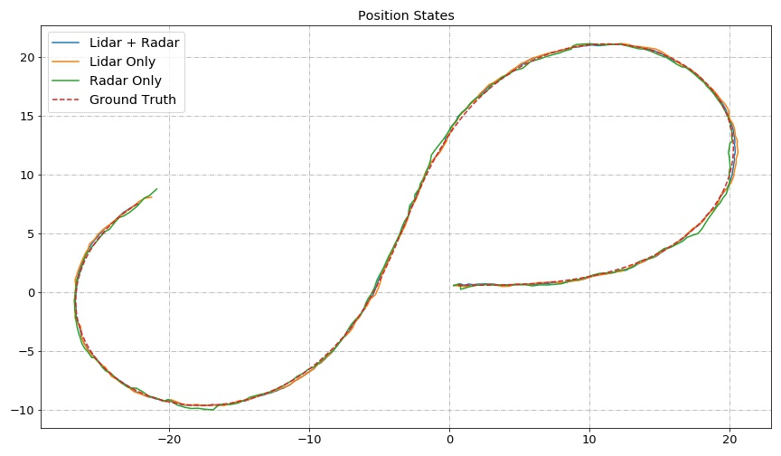
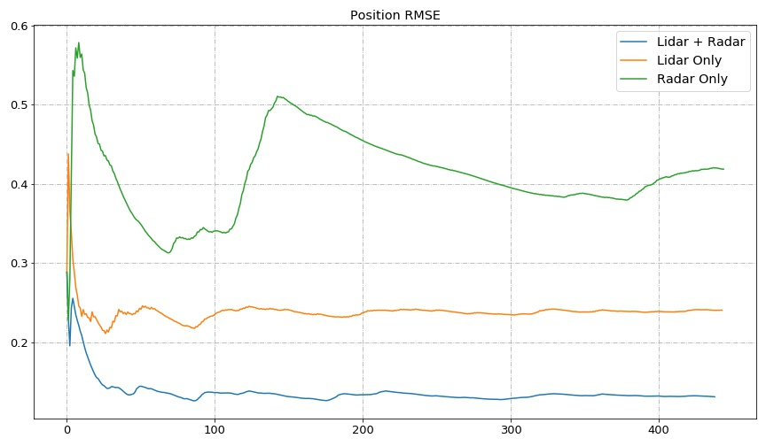
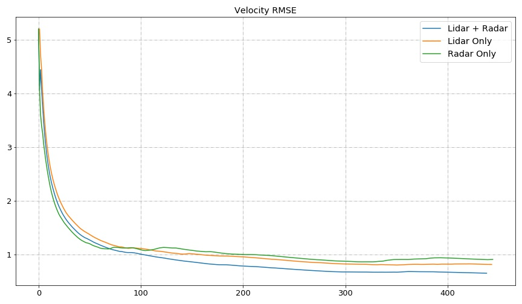

# Kalman Filter, An Overview 

- I have prepared this repository to summarize Kalman filter processes based on following resources: 

  - [Lectures in the Kalman Filter](http://www.ilectureonline.com/lectures/subject/SPECIAL%20TOPICS/26/190)
  - Udacity Self-Driving car courses 
  - Some other online reading materials 
  
- Due to a deficiency in GitHub in parsing LaTex equations, I have put the content in the [Pipeline Jupyter file](Pipeline-01.ipynb) for better readability. 

# Project Example Results 

The results of the term project are presented here. The [data](/data) provided for this project contains: 

- Lidar and Radar measurement data 
- Ground truth values 

The small piece of program provided uses the received data (lidar and radar measurements) and update the states using EKF equations stated above. To compare the results, in the main function of code we can control which measurement data to be used for estimation. As a result, we ran the program three times using the same data file, however, with different permutation of operational sensors. The comparison of the results shown below reveal that in all the cases studied, utilizing both sensors would give better results as compared to using only one. 

### Comparison of Position States 

### Comparison of Mean Errors of Position States 

### Comparison of Mean Errors of Velocity States 

